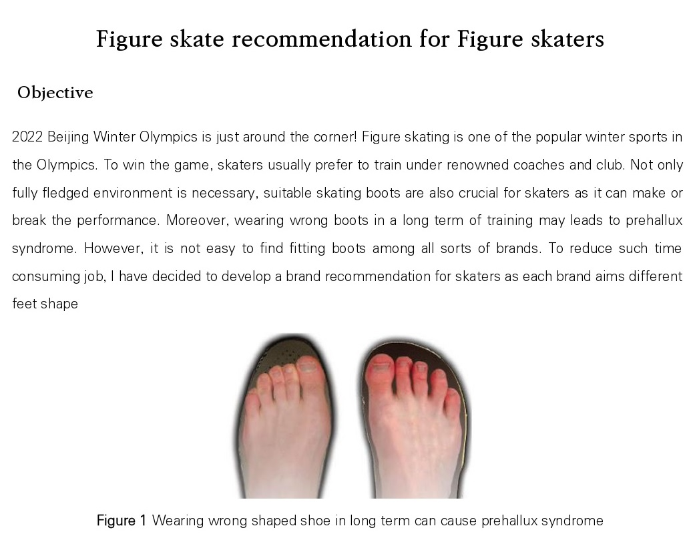

## ⛸Find me a Skate⛸

  
   
  

  Final project on GE class, Introduction to AI platform  
  

---

### Wrap up and Conclusion
As the model is trained with limited amount of data, some irregular feet shape were not properly classified.   
If feet image datasets fully exist in future, it will definitely help my model to classify more accurately.  
In model training tuning parameters are also crucial. I had hard time spending to find the optimal epoch and batch size, as it can cause over or underfitting. Since I had small amount of image data. I set smaller epoch value than the default one. With several attempts, I luckily found the right value for my model and it worked well on my website.  
